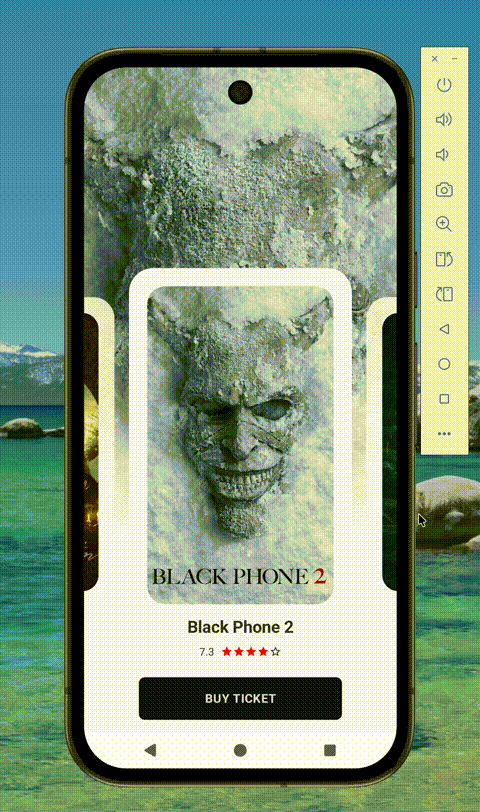

<p align="center">
  <a href="https://www.tiktok.com/@yourusername/video/1234567890123456789">
    
  </a>
</p>
# 🎬 Mufi — Android Showcase App

An Android app that displays a list of **popular movies** using data from TMDB API.  
This project focuses on **UI transitions**, **animations**, and **motion design best practices** in Android development.

---

## ✨ Features

- 📺 Browse a list of trending / popular movies  
- 🎞️ Smooth shared element transitions between list and detail screens  
- 💫 Delightful motion and animation effects across UI components  
- 🌗 Modern Android design 
- 🔄 Reactive architecture with **Jetpack Compose**

---

## 🎨 Focus: UI Transitions & Animations

This repository serves as a **showcase project** to demonstrate:
- Scene transitions between screens
- Animated visibility and content changes
- Compose animation APIs
- Coordinated animations for user interactions
- Smooth state-driven UI updates

> The primary goal is not to build a production-ready app, but to explore and illustrate **how animations can enhance UX** in Android.

---

## 🧩 Tech Stack

- **Language:** Kotlin  
- **UI:** Jetpack Compose
- **Architecture:** MVVM
- **Libraries:**
  - Jetpack Navigation
  - Coil for image loading
  - Ktor for network requests
  - Material Components
  - Compose Animation APIs

---

## 🧠 Learning Objectives

This project is ideal if you want to:
- Learn how to build fluid motion-driven interfaces
- Understand animation APIs in Android using Compose
- Explore best practices for UI transitions and state animations

---

## 🚀 Getting Started

1. Clone the repo:
   ```bash
   git clone https://github.com/<your-username>/popular-movies-android.git
   ```
2. add TMDB_API_KEY in local.properties
2. Open the project in **Android Studio (Giraffe or newer)**.
3. Sync Gradle and run the app on an emulator or device.

This project is licensed under the **MIT License** — feel free to use, modify, and learn from it.

---

**Made with ❤️ for Android motion enthusiasts.**
